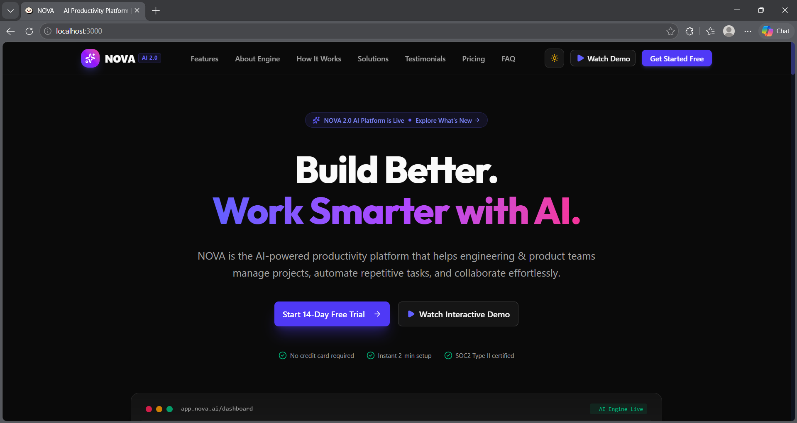
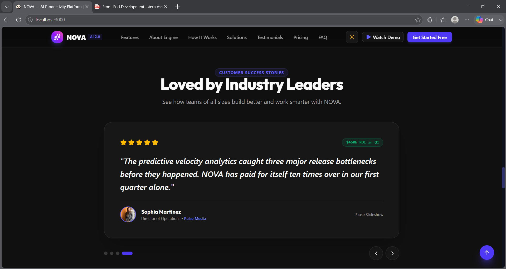
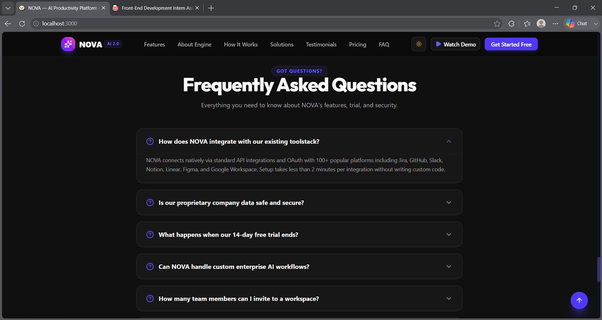

# NOVA — AI Productivity Platform 🚀

> **Tagline:** Build Better. Work Smarter.  
> **Front-End Assignment:** Reusable Component Architecture with Tailwind CSS & React.

---

## Live Demo URL
https://nova-ai-ten-kappa.vercel.app/

## Screenshots







## 🌟 Overview

**NOVA** is an AI-powered productivity platform designed to help software engineering, product, marketing, and operations teams manage projects, automate repetitive manual workflows, and collaborate seamlessly.

This repository (`/l2`) represents a modular, component-driven implementation built using **React**, **TypeScript**, **Tailwind CSS**, and **Bun**. All 13 required website sections and bonus interactive features have been broken down into clean, reusable React components styled with Tailwind CSS utility classes.

---

## 🚀 Technologies Used

- **Framework & Runtime:** React 19, TypeScript, Bun
- **Styling:** Tailwind CSS v4, Custom CSS Animations, Dark/Light theme design system
- **Icons:** Lucide React (`lucide-react`)
- **UI Components:** Class Variance Authority (`cva`), `clsx`, `tailwind-merge`
- **Build Tool:** Bun Bundler (`bun run build`)

---

## 🎨 Component Architecture & Structure

```
l2/
├── styles/
│   └── globals.css             # Tailwind theme variables, OKLCH colors & dark mode
├── src/
│   ├── types/
│   │   └── landing.ts          # TypeScript interfaces for Features, FAQs, Testimonials
│   ├── data/
│   │   └── landingData.ts      # Structured mock data & configuration
│   ├── lib/
│   │   └── utils.ts            # Utility functions (cn helper)
│   ├── components/
│   │   ├── ui/                 # Reusable UI primitives (Button, Card, Badge)
│   │   ├── Navbar.tsx          # 1. Responsive Navbar + Theme Toggle + Mobile Menu
│   │   ├── Hero.tsx            # 2. Hero Section + Interactive Dashboard Mockup Card
│   │   ├── TrustedBy.tsx       # 3. Trusted By / Company Logos Grid
│   │   ├── Features.tsx        # 4. Features Grid (8 items) + Category Filter Tabs
│   │   ├── AboutProduct.tsx    # 5. Product/About Showcase + Engine/Workflow/Analytics Tabs
│   │   ├── HowItWorks.tsx      # 6. 4-Step Process Section
│   │   ├── Statistics.tsx      # 7. Statistics Section + Animated Scroll Counters
│   │   ├── Solutions.tsx       # 8. Solutions / Use Cases + Role Switcher Tabs
│   │   ├── Testimonials.tsx    # 9. Testimonials Section + Carousel + Autoplay Pause/Resume
│   │   ├── Pricing.tsx         # 10. Pricing Section (3 Plans) + Monthly/Annual Discount Toggle
│   │   ├── FAQ.tsx             # 11. FAQ Section + Interactive Accordion
│   │   ├── FinalCTA.tsx        # 12. Final CTA Section + Newsletter Email Validation Form
│   │   ├── Footer.tsx          # 13. Footer + Quick Links + Operational Status Ping
│   │   ├── BackToTop.tsx       # Floating Scroll-to-Top Button
│   │   └── DemoModal.tsx       # Interactive Demo Modal (Watch Tour / Book Meeting)
│   ├── App.tsx                 # Main application state orchestration
│   ├── frontend.tsx            # React DOM mounting entry point
│   ├── index.css               # Base CSS styles, scrollbar, glassmorphism
│   └── index.html              # HTML shell with Google Fonts & SEO Meta tags
├── README.md                   # Project documentation
└── package.json                # Dependencies and build scripts
```

---

## ✨ Features & Interactions Summary

### Required Sections (13 / 13 Completed)
1. **Navigation Bar:** Sticky header with responsive navigation links, dark/light theme switch, and quick CTA buttons.
2. **Hero Section:** High-converting copy, launch notification pill, CTAs, and interactive sandbox preview.
3. **Trusted By:** Logos of enterprise companies using NOVA.
4. **Features (8 features):** Categorized view for Automations, Collaboration, and Analytics with interactive filter buttons.
5. **Product / About Section:** Interactive tab switcher illustrating Core AI Engine, Visual Workflow Studio, and Executive Analytics.
6. **How It Works:** 4-step visual onboarding breakdown.
7. **Statistics:** Key metrics with dynamic count-up scroll animations.
8. **Solutions / Use Cases:** Specialized views tailored for PMs, Engineering Leads, Marketers, and Executives.
9. **Testimonials:** Customer reviews with ratings, metrics, and interactive slideshow controls.
10. **Pricing:** 3 transparent pricing tiers (Starter, Pro Team, Enterprise) with an interactive 20% annual discount toggle switch.
11. **FAQ:** Interactive accordion with smooth open/close toggles.
12. **Final CTA:** High-impact banner with newsletter email validation.
13. **Footer:** Comprehensive site directory links and live system health indicator.

### Bonus Features Included
- 🌙 **Dark/Light Mode:** Full dark mode toggle persisted in local storage.
- ⚡ **Animated Statistics:** IntersectionObserver count-up animation when scrolling into view.
- 🎠 **Testimonial Carousel:** Auto-playing slideshow with manual navigation & pause/resume state.
- 💰 **Pricing Toggle:** Monthly vs. Annual billing switcher with dynamic price calculation.
- 🎬 **Demo Modal:** Interactive modal with simulated video timeline, playback controls, and 1-on-1 booking form.
- ✉️ **Newsletter Validation:** Regex email validation with instant feedback banners.
- ⬆️ **Back-to-Top Button:** Smooth scrolling trigger that appears after scrolling 300px down.

---

## 🛠️ How to Run Locally

### Prerequisites
Make sure you have [Bun](https://bun.sh) or Node.js installed.

### Installation
```bash
# Navigate to the l2 directory
cd l2

# Install dependencies
bun install
```

### Start Development Server
```bash
bun dev
# or
bun start
```
Open your browser at `http://localhost:3000` to preview the landing page.

### Build for Production
```bash
bun run build
```

---

## 🤖 AI Tools Used
- **AI Coding Assistant:** Used for rapid prototyping, Tailwind class organization, type safety verification, and component modularization.
